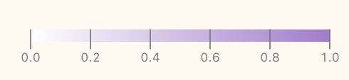
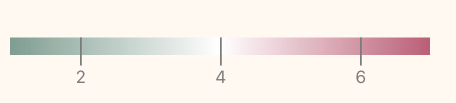

```js
import { utcParse } from 'npm:d3-time-format'
import * as d3 from 'npm:d3'
import { csvFormat } from 'd3-dsv'

// function to correctly process prediction data
const coerceRowPred = d => ({
  date: new Date(d.index),
  'Overall Fatigue': Number(d.cis_subjective_fatigue),
  'Muscle Tiredness': Number(d.extra_muscles_tired),
  'Muscle Soreness': Number(d.hooper_muscles_sore),
  person: d.person,
  model: d.model
})

// function to correctly process survey data
const coerceRowSurvey = d => ({
  date: new Date(Date.parse(d.date)),
  'Overall Fatigue': Number(d.cis_subjective_fatigue),
  'Muscle Tiredness': Number(d.extra_muscles_tired),
  'Muscle Soreness': Number(d.hooper_muscles_sore),
  'Step Count': Number(d.step_count),
  'Sleep Time': d.sleep_time,
  'Alcohol Intake': d.alcohol,
  'Coffee Intake': d.coffee_count,
  person: d.person
})

// read in data
let predictions = FileAttachment('data/predictions.csv')
  .csv({ typed: true })
  .then(D => D.map(coerceRowPred))
let surveyData = FileAttachment('data/pre_processed_survey_features.csv')
  .csv({ typed: true })
  .then(D => D.map(coerceRowSurvey))


// pick person 
const pickPersonInput = Inputs.radio(['Amanda','Johanna'], {value: "Amanda"})
const pickPerson = Generators.input(pickPersonInput)


```

<style type="text/css">
p {
  max-width: null;
}
</style>

# The Study

To test (or maybe rather get some first impression), whether it is possible to predict **subjective** experiences of fatigue, for 35 days we (1) took two muscle measurements (see <a href='/protocol#muscle-data-measurement-protocol'>protocol</a>)  - one in the morning after waking up, one in the evening before going to bed and (2) filled out a questionnaire (see <a href='/protocol#survey'>survey</a>).

We had three main outcomes of interest:
- **Overall fatigue** [1-7]: Experienced level of fatigue throughout a day. Did we feel tired and worn out? Or rather energetic and motviated?
- **Muscle soreness**[1-7]: Experienced level of muscle soreness throughout a day across the body. Were there any muscles that felt stiff or aching? Or did they rather feel 'fresh'? Supposed to relate to the physiological concept of peripheral muscle weakness (peripheral fatigue) (see <a href='http://127.0.0.1:3000/research#characterization-of-muscle-fatigue'> Davis, 1999 </a>).
- **Muscle tiredness**[1-7]: Experienced level of muscle tiredness throught a day across the body. How 'worn out' did your muscle feel, how much willpower did you need to move?  Supposed to relate to the physiological concept of central nervous system muscle fatigue  (see <a href='http://127.0.0.1:3000/research#characterization-of-muscle-fatigue'> Davis, 1999 </a>).


For the remainder you can pick a person whose data you want to explore: 
```js
view(pickPersonInput)
```
The below plot shows the three main outcomes of interest over time: **overall fatigue**, **muscle soreness** and **muscle tiredness**. Everyday we retrospectively assessed or subjective experience of those. Values range from 1 (= very low) to 7 (= very high). It further shows the levels of some other variables in relation to their respective maximum, e.g. if step count is dark purple, the number of steps on that days was close to the maximum number of daily steps measured during the study period.

```js
// subset data to person picked
let predictions2 = predictions.filter(d => d.person === pickPerson)
let surveyData2 = surveyData.filter(d => d.person === pickPerson)

// pivot data longer
let data = aq
  .from(surveyData2) // create an arquero table from our data
  .fold(aq.not('date'), { as: ['name', 'value'] }) // unpivot/fold the data by date
  .objects()

// get unique model names to choose from
const uniqueNames = [...new Set(predictions.map(item => item.model))]

// pick model name
const pickModelInput = Inputs.radio(uniqueNames.filter(item => item !== 'Ground Truth'), { value: 'Lasso' })
const pickModel = Generators.input(pickModelInput)

// define max and respective color scale for variables
const colorSteps = Plot.scale({color: {range: ['#fff9f1','#A07ECE'], domain: [0,Math.max(...surveyData.map(obj => obj['Step Count']))]}});
const colorSleep = Plot.scale({color: {range: ['#fff9f1','#A07ECE'], domain: [0,Math.max(...surveyData.map(obj => obj['Sleep Time']))]}});
const colorAlcohol = Plot.scale({color: {range: ['#fff9f1','#A07ECE'], domain: [0,Math.max(...surveyData.map(obj => obj['Alcohol Intake']))]}});
const colorCoffee = Plot.scale({color: {range: ['#fff9f1','#A07ECE'], domain: [0,Math.max(...surveyData.map(obj => obj['Coffee Intake']))]}});

// plot correlation matrix over time
function CorrelationPlot(width) {
  return Plot.plot({
    marginLeft: 150,
    width: width,
    y:{label: 'Variable'},
    color: {
      type: 'linear',
      range: ['#819E90', 'white', '#B65F77'],
      domain: [1, 7],
   //   legend: true
    },

    marks: [
      Plot.cell(
        data.filter(item =>
          Array(
            'Overall Fatigue',
            'Muscle Soreness',
            'Muscle Tiredness'
          ).includes(item.name)
        ),
        {
          x: 'date',
          y: 'name',
          fill: ({ value }) => (value === 0 ? NaN : value),
          title: ({ value }) => value,

          inset: 0.5,
       
          //tip:true
        }
      ),
   
      Plot.cell(
        data.filter(item =>
          Array(
            'Step Count',
           
          ).includes(item.name)
        ),

     //   Plot.map(
       // {fill: Plot.normalize("mean"),

        //},
       {
          x: 'date',
          y: 'name',
          fill:   ({value}) => colorSteps.apply(value),
          title: ({ value }) => value,

          inset: 0.5,
       
         // tip:true
        }
    //)
    ),
    ,
   
      Plot.cell(
        data.filter(item =>
          Array(
            'Sleep Time',
           
          ).includes(item.name)
        ),

     //   Plot.map(
       // {fill: Plot.normalize("mean"),

        //},
       {
          x: 'date',
          y: 'name',
          fill:   ({value}) => colorSleep.apply(value),
          title: ({ value }) => value,

          inset: 0.5,
       
        //  tip:true
        }
    //)
    ),

    Plot.cell(
        data.filter(item =>
          Array(
            'Coffee Intake',
           
          ).includes(item.name)
        ),

     //   Plot.map(
       // {fill: Plot.normalize("mean"),

        //},
       {
          x: 'date',
          y: 'name',
          fill:   ({value}) => colorCoffee.apply(value),
          title: ({ value }) => value,

          inset: 0.5,
       
         // tip:true
        }
    //)
    ),

    Plot.cell(
        data.filter(item =>
          Array(
            'Alcohol Intake',
           
          ).includes(item.name)
        ),

     //   Plot.map(
       // {fill: Plot.normalize("mean"),

        //},
       {
          x: 'date',
          y: 'name',
          fill:   ({value}) => colorAlcohol.apply(value),
          title: ({ value }) => value,

          inset: 0.5,
       
         // tip:true
        }
    //)
    ),
      Plot.text(
        data.filter(item =>
          Array(
            'Overall Fatigue',
            'Muscle Soreness',
            'Muscle Tiredness'
          ).includes(item.name)
        ),

        {
          x: 'date',
          y: 'name',
          text: ({ value }) => Math.round(value === 0 ? NaN : value),
        //  tip:true,
          fill: 'black'
        }
      )
    ]
  })
}
```
<div class="grid grid-cols-2" style="max-width:600px">
<div>
<small>Fraction of maximum value</small>

</div>
<div>
<small>Fatigue levels</small>


</div>
</div>

${resize((width) => CorrelationPlot(width))}

```js

// define plot of values over time (currently not shown)
function LinePlot() {
  return Plot.plot({
    y: { domain: [1, 7] },
    width: 1000,
    height: 300,
    marginRight: 150,
    color: {
      range: ['#A07ECE', '#819E90', '#B65F77'],
      domain: ['Overall Fatigue', 'Muscle Soreness', 'Muscle Tiredness'],

      legend: true
    },
    x: {
      ticks: 10,
      //domain: [new Date('2024-7-08'), new Date('2024-08-14')]
    },
    marks: [
      // Plot.dot(predictions2.filter((d) => d.model === "Ground Truth"), {x: "date", y: "value", r:2, symbol: "model"}),
      Plot.lineY(
        data.filter(item =>
          Array(
            'Overall Fatigue',
            'Muscle Soreness',
            'Muscle Tiredness'
          ).includes(item.name)
        ),
        {
          x: 'date',
          y: ({ value }) => (value === 0 ? NaN : value),
          stroke: ({ name }) => name,
          tip: true,
          title: d => `${d.name}: ${d.value}`
        }
      ),

      Plot.axisX({ anchor: 'bottom', label: null, tick: 'day' })
    ]
  })
}

//display(LinePlot())
```

# Predictions based on Survey Data

## Are there patterns in our wellbeing that we aren't conciously aware off?

In a first step, we explored whether we can predict subjective experience of fatigue, muscle soreness and muscle tiredness for the next day based on information collected through the <a href='/protocol'>questionnaire </a> the day before. We tested several machine learning models and compared them to (1) our own prediction of how we would feel the next day and (2) always predicting the mean level.


```js
const dataFiltered = predictions2.filter(d => d.model === pickModel)
const dataTrue = predictions2.filter(d => d.model === 'Ground Truth')

const colorDict = {
  'Overall Fatigue': '#A07ECE',
  'Muscle Soreness': '#819E90',
  'Muscle Tiredness': '#B65F77'
}

function calculateMeanDifference(array1, array2, property) {
  if (array1.length !== array2.length) {
    throw new Error('Arrays must have the same length')
  }

  let totalDifference = 0
  let count = 0

  for (let i = 0; i < array1.length; i++) {
    if (array1[i][property] != null && array2[i][property] != null) {
      totalDifference += Math.abs(array1[i][property] - array2[i][property])
      count++
    }
  }

  return count === 0 ? 0 : totalDifference / count
}
let maxDate = Math.max(...predictions2.map(obj => obj.date))
let minDate = Math.min(...predictions2.map(obj => obj.date))

// function for prediction  lineplot
function PredictionPlot(predictions, model, variable, width) {
  return Plot.plot({
    x: {
      tickFormat: d3.utcFormat('%b %e'),
      ticks: 5,
      nice: true,
    domain: [new Date(minDate), new Date(maxDate)],
    },
    symbol: { legend: true },
    // marginLeft: 80,
    //marginRight: 150,
    width: width,
    height: 200,
    y: { ticks: 7, domain: [1, 7], label: null },
    marks: [
      Plot.ruleY([0]),
      //Plot.areaY(predictions2.filter((d) => d.model === "Human Prediction"), {x: "date", y: "cis_subjective_fatigue", fillOpacity: 0.2}),
      Plot.lineY(
        predictions.filter(d => d.model === model),
        {
          x: 'date',
          y: variable,
          stroke: 'grey',
          strokeDasharray: 10,
          title: d => d[variable]
          //tip: true
        }
      ),

      Plot.dot(
        predictions.filter(d => d.model === 'Ground Truth'),
        { x: 'date', y: variable, r: 2, symbol: 'model' }
      ),
      Plot.dot(
        predictions.filter(d => d.model === model),
        { x: 'date', y: variable, r: 2, symbol: 'model' }
      ),

      Plot.lineY(
        predictions.filter(d => d.model === 'Ground Truth'),
        {
          x: 'date',
          y: variable,
          stroke: 'grey',
          title: d => d[variable]
          //tip: true
        }
      ),

      //Plot.text(predictions.filter((d) => d.model === "Ground Truth"), Plot.selectLast({x: "date", y: variable, text: "model", textAnchor: "start", dx: 5, dy: 0})),
      // Plot.text(predictions.filter((d) => d.model === model), Plot.selectLast({x: "date", y: variable, text: "model", textAnchor:"start", dx: 5, dy:0})),

      //Plot.ruleX([parseDate("2024-08-07")]),
      Plot.text(
        [
          'MAE: ' +
            Math.round(
              calculateMeanDifference(dataFiltered, dataTrue, variable) * 100
            ) /
              100
        ],
        {
          frameAnchor: 'top',
          textAnchor: 'start',
          x: new Date(minDate),
          fontSize: 15
        }
      ),
      Plot.areaY(
        predictions.filter(
          d => d.model === model || d.model === 'Ground Truth'
        ), //  Plot.windowY(
        //  14,
        Plot.groupX(
          {
            y1: Plot.find(d => d.model === model),
            y2: Plot.find(d => d.model === 'Ground Truth')
          },
          {
            x: 'date',
            y: variable <= 0 ? NaN : variable,
            //title: (d) => Math.round(d[variable],2),
            tip: true,
            opacity: 0.3,
            fill: colorDict[variable]
            //positiveFill: "#A07ECE",
            //negativeFill: "#A07ECE",
          }
        )
        // )
      )
      //Plot.lineY(predictions, {x: "date", y: "value"})
    ]
  })
}

// pick person 


let modelInfo = {"Lasso": "Lasso Regression - A fairly simple, non-temporal model - a specific day's fatigue level is regressed on survey information from the day before",
"Random Forest": "Creates decision trees to predict a specific day's fatigue level based on survey variables from the day before and combines their results by averaging. Only data from the previous day is considered.",
"Random forest time series": "An auto-regressive random forest based model - only takes into account values of the outcome variable from the 5 previous days.",
"Random forest multiseries": "An auto-regressive random forest based model based on multiple time series - also takes into account past values of other variables from the past 5 days and jointly predicts their values for the next day.",
"Gradient Boosting": "Creates sequential decision trees where each new tree tries to correct the errors made by the previous trees. Trys to predict a specific day's fatigue level based on survey variables from the day before.",
"Gradient boosting timeseries": "An auto-regressive gradient boosting model - only takes into account values of the outcome variable from the 5 previous days",
"Gradient boosting multiseries": "An auto-regressive gradient boosting model based on multiple time series - also takes into account past values of other variables from the past 5 days and jointly predicts their values for the next day.",
"Human Prediction": "The self-predicted value of the outcome variable, predicted on the evening before for the next day.",
"Always predicting the mean": "Comparing the mean value to observed values."

}
```
## Predictions for ${pickPerson}
### Models
${pickModelInput}

### Model Selected: ${pickModel}
${modelInfo[pickModel]}

<div class="grid grid-cols-3">

 <div class="card">
 <h3> Overall Fatigue</h3>
${resize((width) => PredictionPlot(predictions2, pickModel, 'Overall Fatigue',width))}

  </div>
<div class="card">
<h3> Muscle Soreness </h3>
${resize((width) => PredictionPlot(predictions2, pickModel, 'Muscle Soreness',width))}
</div>
<div class="card">
<h3> Muscle Tiredness </h3>
${resize((width) => PredictionPlot(predictions2, pickModel, 'Muscle Tiredness',width))}

</div>

</div>

## Discussion
### What does all of this tell us?
Well... it seems like fatigue levels and behavior are not too much indicative of the next days' fatigue levels.

#### Amanda
Generally speaking, Amanda's predictions of her muslce soreness & tiredness levels for the next days, were slightly worse than just always predicting the mean level observed within the previous month. For the overall fatigue level her own predictions were slightly better - mostly Amanda is a bit too pessimistic.  <br> When it comes to the different models, in terms of absolute error, all of them perform worse than just always predicting the mean. <br>

#### Johanna
Generally speaking, Johanna's own predictions for overall fatigue and muscle tiredness were worse than always just predicting the mean. For muscle soreness, her predictions were fairly accurate - at least better than all machine learning modelsor simply choosing the mean. <br> When it comes to the different models, standard random forest performed best for overall fatigue and muscle tiredness. However, it only slightly outperformed always predicting the mean value. While it was quite a bit better than Johanna's own predictions, looking at the SHAP values tells us that Johanna's prediction for the next day nonetheless was the most important variable for predicting. For muscle tiredness also scoring high on the item 'I felt fit' actually increased the likelihood of high muscle tiredness the next day, indicating that feeling fit and potentially moving a lot might have negative effects on muscular fitness the day after. For muscle soreness, lasso regression performed best - looking at the coefficients tells us that, somewhat non-surprisingly, doing HITT exercise was the most relevant predictor of muscle soreness.
Of course there could be different reasons why the machine learning models are not really good at predicting:
<ul>
<li> <strong> The things measured in the survey are not relevant: </strong> It could be that there is just not a lot of predictive value in the survey data, i.e. the variables that we have collected are not related to the next days. This means that (1) the subjective level of fatigue and muscle impairment on one day is not very much related to the levels experienced on the next day. Looking at the auto-correlations (code for plotting those is included in the <a href='/code'> code </a>), this can be confirmed - while there is more auto-correlation than one would expect from a random walk, there is only a very weak correlation (~0.2) for muscle impairment and inconsistent correlations for the fatigue measure. Further, (2) the other collected variables also don't play a big role for determining fatigue and muscle impairment, i.e. whether Amanda did sports, drank alcohol and/or a lot of coffee was not particularly relevant for her wellbeing on the next day. This means that there is probably other factors determining this - these could be some factors that we have overlooked (e.g. nutrition, weather) or factors that are hard to quantify (e.g. stress, mood). Also, considering our small sample size, measurement errors and randomness probably played a big role as well. </li>
<li> <strong> We did't pick the 'correct' prediction models or made a mistake: </strong> While we did our best in trying out different, commonly used frameworks there, of course, exist other models, different ways of pre-processing, different hyperparameter settings etc. that could have resulted in different outcomes - and who knows - maybe been doing a better job in making sense of the collected data. Additionally, there is also still the possbility that we made some errors along the way - feel free to look at our <a href='/code'> code </a> and let us know if you spot any.</li>

<li> <strong> It's just unpredictable: </strong> Maybe, even if we could gather all the data there is we would still not be able to predict subjective experiences of fatigue and muslce impairment, i.e. there is too much randomness involved to make any sensible prediciton.</li>
</ul>

</div>


```js
let rawEMGExample = FileAttachment('data/amanda_raw_emg_example.csv')
  .csv({ typed: true })

let bandpassEMGExample = FileAttachment('data/amanda_bandpass_emg_example.csv')
  .csv({ typed: true })

let rectEMGExample = FileAttachment('data/amanda_rect_emg_example.csv')
  .csv({ typed: true })

let normEMGExample = FileAttachment('data/amanda_norm_emg_example.csv')
  .csv({ typed: true })
```

```js
let startTabata = 32.7
function EMGPlot(data, title,width) {
  
  return Plot.plot({
    //axis: null,
      height: 150,
      width: width,
       grid: true,
  marginRight: 60,
  marginBottom:60,
  facet: {data: data, x: "Signal type", label: title, fontSize: 35,style: {
    fontSize: 30,
  }},
  x:{label:null},
  y:{label: null},
    marks:[
    
        Plot.lineY(
        data,
        {
        x: 'Time',
        y: 'Signal',
        opacity: 0.7,

        }
      ),
    // mark start of sections
    Plot.ruleX(data.filter(d => d['Processing stage'] === 'Normalized signal'), {x: [startTabata], stroke: "#A07ECE", strokeWidth: 2}),
    Plot.ruleX(data.filter(d => d['Processing stage'] === 'Normalized signal'), {x: [startTabata+16], stroke: "#A07ECE", strokeWidth: 2}),
    Plot.ruleX(data.filter(d => d['Processing stage'] === 'Normalized signal'), {x: [startTabata+32], stroke: "#A07ECE", strokeWidth: 2}),
    Plot.ruleX(data.filter(d => d['Processing stage'] === 'Normalized signal'), {x: [startTabata+58], stroke: "#A07ECE", strokeWidth: 2}),
    Plot.ruleX(data.filter(d => d['Processing stage'] === 'Normalized signal'), {x: [startTabata+93], stroke: "#A07ECE", strokeWidth: 2}),


    // label start of sections
    Plot.text(data.filter(d => d['Processing stage'] === 'Normalized signal'), {text:['Relax'], x: startTabata-30, dy:-20,  dx: -10, lineAnchor:'top', rotate: 270,fill: 'black'}),
    Plot.text(data.filter(d => d['Processing stage'] === 'Normalized signal'), {text:['M1'], dy:-20,  dx: -10, lineAnchor:'top', rotate: 270,fill: 'black'}),
    Plot.text(data.filter(d => d['Processing stage'] === 'Normalized signal'), {text:['M2'],  x: startTabata+16, dy:-20,  dx: -10, lineAnchor:'top', rotate: 270,fill: 'black'}),
    Plot.text(data.filter(d => d['Processing stage'] === 'Normalized signal'), {text:['M3'],  x: startTabata+32, dy:-20,  dx: -10, lineAnchor:'top', rotate: 270,fill: 'black'}),
    Plot.text(data.filter(d => d['Processing stage'] === 'Normalized signal'), {text:['Wallsit'],  x: startTabata+58, dy:-20,  dx: -10, lineAnchor:'top', rotate: 270,fill: 'black'}),
    Plot.text(data.filter(d => d['Processing stage'] === 'Normalized signal'), {text:['Relax'],  x: startTabata+93, dy:-20,  dx: -10, lineAnchor:'top', rotate: 270,fill: 'black'}),

    ]
})
}


```

<div class="grid grid-cols-2">
<div>

## Using Muscle Data

In addition to the daily survey data, we also collected sensor data about muscle activity twice a day, using an <a href='/sensor-kit'> EMG & MMG sensor kit </a>, following a strict <a href='/protocol'> protocol </a>. A large body of literature has been trying to use these types of data to assess and/or predict (muscle) fatigue (see <a href='https://dl.acm.org/doi/10.1145/3648679'>here </a> for a great literature review or <a href="/research">here </a> for our summary) - with varying success.

Based on the existing literature, we developed a protocol that we hoped would allow us to gather data with high enough quality to be of use while still being short and easy to follow such that we could integrate it in our daily schedule.

### Pre-Processing

In a first step, the EMG and MMG data was pre-processed. In this case we (1) substracted the mean and applied a bandpass filter with a lower bound of 50 and an upper bound 450 Hz, (2) rectified the signal and (3) performed amplitude normalization. The last plot also shows the starting points of the different phases in the <a href='/protocol'> protocol </a>, where 'M' stands for muscle contraction.

</div>
<div>
 ${resize((width) => EMGPlot(rawEMGExample,'Raw signal', width))}
${resize((width) => EMGPlot(bandpassEMGExample, 'Bandpass filtered signal',width))}
 ${resize((width) => EMGPlot(rectEMGExample, 'Rectified signal',width))}
 ${resize((width) =>EMGPlot(normEMGExample, 'Normalized signal',width))}
    </div>
  </div>

```js
let SignalFeatures = FileAttachment('data/amanda_features_example.csv')
  .csv({ typed: true })
```
```js


function FeaturesPlot(data) {
  
  return Plot.plot({
    //axis: null,
      //height: 150,
      width: width/2,
       grid: true,
  marginRight: 60,
  marginBottom:60,
  fy:{label:null},
  facet: {data: data, y: "variable",  x:'Signal Type', fontSize: 35,style: {
    fontSize: 30,
  }},
  x:{label:null},
  y:{label: null},
    marks:[
       Plot.axisY({ticks: []}),
    
        Plot.lineY(
        data,
        {
        x: 'START',
        y: 'value',
        opacity: 0.7,

        }
      ),
    ]
  })
}
```


<div class="grid grid-cols-2">
<div>
<h3>Feature based prediction </h3>
<p>In the next steps, we extracted features, i.e. transformations of the signal based on the features that have been reported to be predictive of muscular fatigue in <a href="/research">previous studies</a>. Those were always extracted for sub-signals of a length of 250ms (as recommended by previous <a href="/research">literature</a>), i.e. each measurement recording was 'chopped up' into many smaller instances. We used those to train two different types of models: a neural network and a random forest model. Both were trained to predict for every sub-sequence and the final result, i.e. the prediction of fatigue for a particular day as obtained by averaging over all the predictions for that day based on each subsequence. Apart from the features extracte from the signal the models were also given indicators for which interval of the recording a subsequence belonged to (e.g. wallsit) and whether the recording had been created in the morning or evening.


</p>

</div>
<div>
 ${resize((width) =>FeaturesPlot(SignalFeatures,width))}
 </div>
  </div>


```js

// function to correctly process prediction data

let predictionsSignal = FileAttachment('data/amanda_signal_predictions.csv')
  .csv({ typed: true })
  .then(D => D.map(coerceRowPred))
```
```js
let predictionsSignal2= predictionsSignal.filter(d => d.person === pickPerson)

// pick model name
const pickModelInputSignal = Inputs.radio(['Random forest','Neural network','Always predicting the mean'], { value: 'Random forest' })
const pickModelSignal = Generators.input(pickModelInputSignal)
```

${pickModelInputSignal}

<div class="grid grid-cols-3">

 <div class="card">
 <h3> Overall Fatigue</h3>
${resize((width) => PredictionPlot(predictionsSignal2,pickModelSignal, 'Overall Fatigue',width))}

  </div>
<div class="card">
<h3> Muscle Soreness </h3>
${resize((width) => PredictionPlot(predictionsSignal2,pickModelSignal, 'Muscle Soreness',width))}
</div>
<div class="card">
<h3> Muscle Tiredness </h3>
${resize((width) => PredictionPlot(predictionsSignal2,pickModelSignal, 'Muscle Tiredness',width))}

</div>

</div>