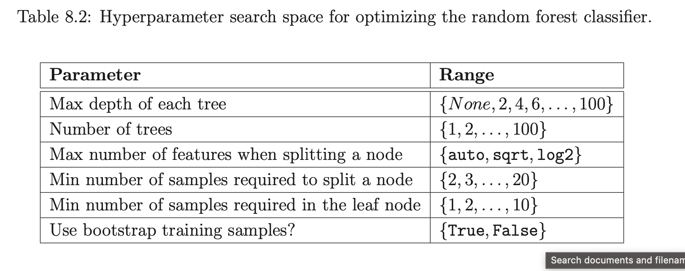

# Characterization of Muscle Fatigue
## [Davis, 1999](http://www.bentrem.sycks.net/NutritionInSport-Ronald-J-Maughan.pdf#page=189)
"The problem is complex because fatigue can be caused by peripheral muscle weakness
(peripheral fatigue) or by a failure to initiate or sustain voluntary drive to the muscle by the central nervous system (CNS fatigue)."

"CNS fatigue is also thought to be the most likely explanation of fatigue that accompanies viral or bacterial infections, recovery from injury or surgery, chronic fatigue syndrome, depression, ‘jet lag’ and meal-induced sleepiness and fatigue (Davis & Bailey 1997). However, a full understanding of the causes of fatigue in these situations will await future studies designed to provide plausible neurobiological mechanisms to explain the fatigue."
# Studies trying to predict fatigue based on EMG data

## [Li, 2024](https://dl.acm.org/doi/pdf/10.1145/3648679)
> Na Li, Rui Zhou, Bharath Krishna, Ashirbad Pradhan, Hyowon Lee, Jiayuan He, and Ning Jiang. 2024. Non-invasive Techniques for Muscle Fatigue Monitoring: A Comprehensive Survey. ACM Comput. Surv. 56, 9, Article 221 (September 2024), 40 pages. https://doi.org/10.1145/3648679 

### Fatigue Measurement

- Wet biomarkers are "biological substances measured in body fluids such as blood,saliva, or urine" -> but are usually dependent on invasive technologies & 
- Dry biomarkers are usually easy to acquire
    - subjective measures
    - performance-related methods
    - physiological signal-based methods: detect the onset of fatigue based on changes in subjects’ physiological responses
        - near-infrared spectroscopy (NIRS) detects fatigue by measuring the amount of oxygen in the muscle
        - mechanomyogram (MMG) can record the vibration of muscle during muscle fiber movement and then observe the mechanical signals on the surface of the contracted muscle
        - Ultrasound (US) describes the structural and morphological changes of skeletal muscle
        - EMG measures activation state of muscles

### Pre Processing
EMG Pre Processing 
- digital filtering, segmentation, rectification (e.g.,
full-wave rectification and half-wave rectification)
    - most commonly used EMG signal filter is essentially a finite impulse response bandpass filter with a cutoff point of 20 Hz and 500 Hz
- temporal windowing
    - slice” continuouss EMG data into short segments for subsequent analyses - analysis window length should not exceed 200 ms (Huang et al.)
    - 150–250 ms as the optimal tradeoff between the classification accuracy and the delay
    - 200–300 ms for the disjoint (Smith et al.) and 225–300 ms for the overlap windowing technique, respectively (Ashraf et al.)
-  smoothing (e.g., Average Rectified Value (ARV) and Root Mean Square (RMS))
-  amplitude normalization

### Features
#### EMG
Time domain features:
- RMS of EMG envelope: RMS value of the windowed sEMG
- integrated EMG (IEMG): area under the curve of the rectified raw sEMG signals, i.e., the mathematical integral of the absolute value of the raw sEMG signals

Frequency domain features:
- Fast Fourier Transform (FFT) and then extract power spectrum characteristics
    - Mean Power Frequency (MPF): average frequency at which the sum of the product of the EMG power spectrum and frequency is divided by the total
    - Median Frequency (MDF)

Other methods:
- Short-time Fourier Transform (STFT): time-localized frequency information for situations in which frequency components of a signal vary over time
- Continuous Wavelet Transform (CWT) 
- extracting entropy from sEMG is an effective method for analyzing muscle fatigue
#### MMG
- RMS -the greater the muscle activation, the higher the MMG amplitude
- MPF
- MDF
- frequency radio change (FRC)
### Results
#### EMG
- Wellems et al. [93] found that during the 20% MVC isometric contraction of the quadriceps femoris to failure, the MDF and MPF first increased, then decreased, and finally fell below the initial state
- Mehra et al. [94] found that the shape of the EMG spectral distribution of deltoid muscle did not change when performing isometric lateral raise at 60% MVC till the endurance limit but shifted towards lower frequency with an increase of magnitude at characteristic mode frequency

### Protocols
>In most experimental designs on fatigue, subjects were required to perform subject-specific maximum voluntary contraction (MVC).<

most research based on isometric contractions potentially (contractions in which there is no change in the length of the muscle. No joint or limb motion occurs) since EMG signals during isometric contraction can be assumed to be stationary between short-time intervals of 0.5 s–2 s

## [Yousif, 2019](https://iopscience.iop.org/article/10.1088/1757-899X/705/1/012010)
*Yousif, Hayder & Zakaria, Ammar & Abdul Rahim, Norasmadi & Salleh, Ahmad & Sabry, Mustafa & Alfarhan, Khudhur & Kamarudin, Latifah & Syed Zakaria, Syed Muhammad Mamduh & Hasan, Ali & K Hussain, Moaid. (2019). Assessment of Muscles Fatigue Based on Surface EMG Signals Using Machine Learning and Statistical Approaches: A Review. IOP Conference Series Materials Science and Engineering. 705. 012010. 10.1088/1757-899X/705/1/012010.*

### Task
Review existing studies of studies on the assessment of muscles fatigue based on surface EMG signals using machine learning and statistical approaches

### Protocols
Existing studies use very different protocols:

### Fatigue Measurement
>The single most relevant determination of fatigue is done through the measurement of force or power measurement, which is produced during the course of a voluntary effort of maximum intensity, maximal voluntary contractions (MVCs) test. In general, when the subject performs the task of interest or the fatigue task continuously, at the pre-, post- and/or the interim time point, brief MVC tests will be conducted to register the drop of maximal force output from particular muscle. (...) The force output decline rate measured in these MVCs tests will indicate the muscle fatigue pattern.<>
### Pre-Processing
>The EMG transmission needs to remove the high frequencies and low frequencies, while a specific band of frequencies must be transmitted forward, this is done by using a specific filter called a bandpass filter>

Filtration -> Rectification -> Smoothing

### Features
#### Time Domain Features
>The fatigue is related to the increment of the EMG amplitude <
- root mean square (RMS)
- mean absolute value (MAV)
- use multiple time windows (MTW) -> combine signal processing with feature extraction (e.g. Multiple hamming windows (MHW), multiple Slepian windows (MSW) and Multiple trapezoidal windows (MTRW))

#### Frequency Domain Features
- shift towards lower frequencies of the EMG frequency spectrum calculated by fast Fourier transform (FFT) method
- relative changes in the mean (MNF)  to inital value or non-fatigue state
- relative changes in the median power frequencies (MDF) to inital value or non-fatigue state
- mean power frequency (MPF)

#### Time Frequency Domain Features
> first when both amplitude and spectrum increases that’s mean force increase, second when both amplitude and spectrum decreases that’s mean force decrease, third when amplitude increase and spectrum decrease that’s mean fatigue, fourth when amplitude decrease and spectrum increased that’s mean recovery<
- Short-Time Fourier Spectrum (STFT) -> spectrum compression indicates fatigue
- continuous wavelet transforms (CWT)
- discrete wavelet transform (DWT) 
- zero-crossing rate (ZCR)
- averaged instantaneous frequency
- wavelet analysis
- fractal analysis
- instantaneous mean frequency (IMNG)
- instantaneous median frequency (IMDF)
- Wigner distribution (WD)
- Choi-Williams distribution (CWD)
- time-varying autoregressive approach (TVAR)

## [Papakostas, 2019](https://doi.org/10.1145/3316782.3322772)

*Michalis Papakostas, Varun Kanal, Maher Abujelala, Konstantinos Tsiakas, and Fillia Makedon. 2019. Physical fatigue detection through EMG wearables and subjective user reports: a machine learning approach towards adaptive rehabilitation. In Proceedings of the 12th ACM International Conference on PErvasive Technologies Related to Assistive Environments (PETRA '19). Association for Computing Machinery, New York, NY, USA, 475–481. https://doi.org/10.1145/3316782.3322772*

### Task
Predict subjective fatigue (binary) ocurrence during exercise performance using EMG data.

### Protocol
- perform exercise (3 exercises; shoulder flexion (SF), shoulder abduction (SA) and elbow extension (EE)) using Barret WAM arm (give feedback force)
- push against resistor as long as possible
- when feeling fatigued -> tell experimenter (who marks the time point)
- hold for 10 more seconds
- go back to starting position

3 repetitions of each exercise with short breaks in between

### Sample
10 users × 3 exercises × 3 repetitions = 90 EMG recordings.
Sampling frequency: 1926HZ

### Pre- Processing
1. Median filtering technique with a window size of 11 samples
2. Extract short-term features (see below)
3. Calculate mid-term features (see below)

### Features

- Short-term features based on non-overlapping windows with a length of 0.25 seconds
    - Minimum
    - Maximum
    - Standard Deviation
    - Mean
    - Spectral Minimum
    - Spectral Maximum
    - Spectral Standard Deviation
    - Spectral Mean
    - Spectral Entropy
    - Spectral Flux
    - Zero Crossing Rate
    - Energy Entropy
    - Wilson Amplitude (WAMP)
    - for each of the above compute delta between the present set of features and the set of features extracted from the preceeding window
- Mid-term features based on overlapping windows with a length of 2 seconds and a window step of 1 
    - each set of 8 successive short-term feature vectors is described using the minimum, maximum, standard devation and mean information extracted from the short-term feature

### Feature Selection
No inherent computational feature selection.
The above features were selected based on past literature, additional features were also used during experimentation but not included in the final model due to bad performance.

### Models 
Linear SVM, SVM with an RBF Kernel, Gradient-Boosting (GB), Extra-Trees (ET) and Random Forests (RF)

### Post Processing
Classifier makes predictions on a mid-term level -> need to be mapped to longt-term level (i.e. one predcition per sample)

1. Median-filter of size K to the original predictions made by the classifier
3.  Gather the successive assigned labels into groups of M
2. "If in the N past groups, the total number of samples that have been identified as ’FATIGUE’ exceeds a specific threshold, then and only then the method decides that the subject has shown signs of fatigue. Otherwise it assumes that the classification algorithm found a set of false positives and the process continues as if the subject has not been fatigued."  

hyper-parameters were set to K1 = 3, M = 3,STEP = 1,N = 2,THRESH_VAL = 0.6 and K2 = 11

### Results
-> results vary across tests, for  single user evaluation Extra Trees are strongest (78%)

## [Kefalas, 2023](https://hdl.handle.net/1887/3511983)
*Kefalas, M. (2023, January 19). Data-driven predictive maintenance and time- series applications. Retrieved from https://hdl.handle.net/1887/3511983*

as well as 

*M.R. Tannemaat, M. Kefalas, V.J. Geraedts, L. Remijn-Nelissen, A.J.M. Verschuuren, M. Koch, A.V. Kononova, H. Wang, T.H.W. Bäck, Distinguishing normal, neuropathic and myopathic EMG with an automated machine learning approach, Clinical Neurophysiology, Volume 146, 2023, Pages 49-54, ISSN 1388-2457, https://doi.org/10.1016/j.clinph.2022.11.019. (https://www.sciencedirect.com/science/article/pii/S1388245722009622)*

### Task
Build an automated time-series classification algorihtm to distinguish EMG time-series of healthy individuals and individuals either neuropathic or myopathic diseases by considering the two types of disease as one disease class

### Protocol
Data has been collected during routine clinical care 
- patients are asked to muscle at rest, during slight activation, and during (near-) maximal activation
- the last 40s are recorded 

### Sample
380 muscle recordings from 65 muscles (at rest or at maximum con- traction) based on 65 patients with IBM (n = 20), ALS (n = 20) and healthy (control group) (n = 25)

collected using concentric needle electrodes

data were recorded with two sampling rates, namely 4800Hz and 5000Hz comprising of 16642 and 14279 traces

For this study, the . 

### Pre-Processing
- longest artifact-free series of consecutive 0.2s segments from every muscle recording were selected rigorously by clinicians through visual inspection
- 5-second time-series were constructed by stitching together consecutive 0.2s segments of each unique ID (i.e. patient, muscle + side) ->  at 4800Hz results in 24000 data points per examined muscle. 

### Features

Features are extracted based on the Python time series processing package 'tsfresh': https://tsfresh.readthedocs.io/en/latest/text/quick_start.html

### Feature Selection
The feature selection algorithm "boruta" is used.

### Model
Random forest model

### Hyperparameters

Hyperparameter Optimization using Mixed-integer Parallel Efficient Global Optimization (MIP-EGO) for optimizing F1-macro score of a 10-fold cross-validation
Executed 200 times 

### Results
Evaluation based on 10-fold Cross Validation

## [Jaiswal, 2022](https://arxiv.org/abs/2205.00287)

*Jaiswal, Ashish; Zaki Zadeh, Mohammad; Hebri, Aref; Mekdon, Fillia (2022):Assessing Fatigue with Multimodal Wearable Sensors and Machine Learning. arXiv: https://arxiv.org/abs/2205.00287.*

### Task
Predict self-reported cognitive fatigue (CF) and physical fatgiue (PF) based on ECG, EMG & EDA

### Protocol
- take baseline reading from the sensors while subject stood still for 1 min - reading 1
- participants were asked to perform 2 roundsets of 0-Back tasks (to induce CF) - reading 2
- particpants were asked to run on a treadmill for 90s (to induce PF) -reading 3
- participants were asked to perfrom 6 rounds of 2-back tasks (to induce CF) - reading 4
participants were asked to perform 2 roundsets of 0-Back tasks - reading 5
- additional data collection after subject stood still for 90s - reading 6?

### Sample
32 healthy people

### Pre-Processing
readings 1,2,3 were labelled as "No CF"
reading 3 was labelled as "PF"
readings 4,5 were labelled as "CF" and not considered for PF analysis

split signal into mulitple slices based on different window sizes (5 seconds, 10 seconds, 20 seconds)
each slice was labeld the same as the original signal label
whole signal block was classified based on the higher count of the class among the classified slices

### Model
70% train, 15% validation and 15% test sets (on a per subject level)
5 fold cross validation

- logistic regression
- support vector machines
- random forest
- long short-term memory

### Features
169 combined features from ECG, EDA, and EMG for training the ML models

ECG:
- Pan, and Tompkins QRS detection algorithm
- leaned the signals using a high-pass Butterworth filter with a fixed cut-off frequency of 0.5 Hz
- notch filter was applied to the cleaned signal to remove components with 50 Hz frequency and avoid power line interference
- RR intervals were extracted using the R Peaks from the signal and were cleaned by removing the outliers
-  missing values were substituted using the linear interpolation method
- 113 time-domain and frequency-domain features, including heart rate variability (HRV) metrics were extracted

EDA:
- passed through a low-pass Butter- worth signal with a cut-off frequency of 3 Hz
- extraction of phasic component of EDA signal
- Skin Conductance Response (SCR)

EMG: 
- time domain and frequency domain features were extracted 

Most of the feature extraction was carried out using the package named [Neurokit2](https://github.com/neuropsychology/NeuroKit)

### Results

## [Yaman, 2019](https://pubmed.ncbi.nlm.nih.gov/31828145/)
*Yaman E, Subasi A. Comparison of Bagging and Boosting Ensemble Machine Learning Methods for Automated EMG Signal Classification. Biomed Res Int. 2019 Oct 31;2019:9152506. doi: 10.1155/2019/9152506. PMID: 31828145; PMCID: PMC6885261.*

### Task
Classify persons as "Normal", "Myopathy", or "Neuropathy" based on needle EMG data measured on the biceps brachii muscle

### Sample
7 control patients, 7 myopathic subjects and 14 neurpathic subjects

### Pre Processing
signals were collected at 20 kHz for 5 seconds at 12-bit res- olution and band-pass-filtered at 5 Hz to 10 kHz

EMG signals are divided into frames with a length of 2048 samples

Decomposition of the EMG signals using wavelet packet transform up to level 4

### Features

- Coefficients’ mean absolute values in every subband
- Average power of the coefficients in each subband
- Standard deviation of the coefficients in each
subband
- Ratio of the absolute mean values of coefficients of adjacent subbands
- Skewness of the coefficients in each subband
- Kurtosis of the coefficients in each subband

### Models

### Results
10-fold cross-validation

