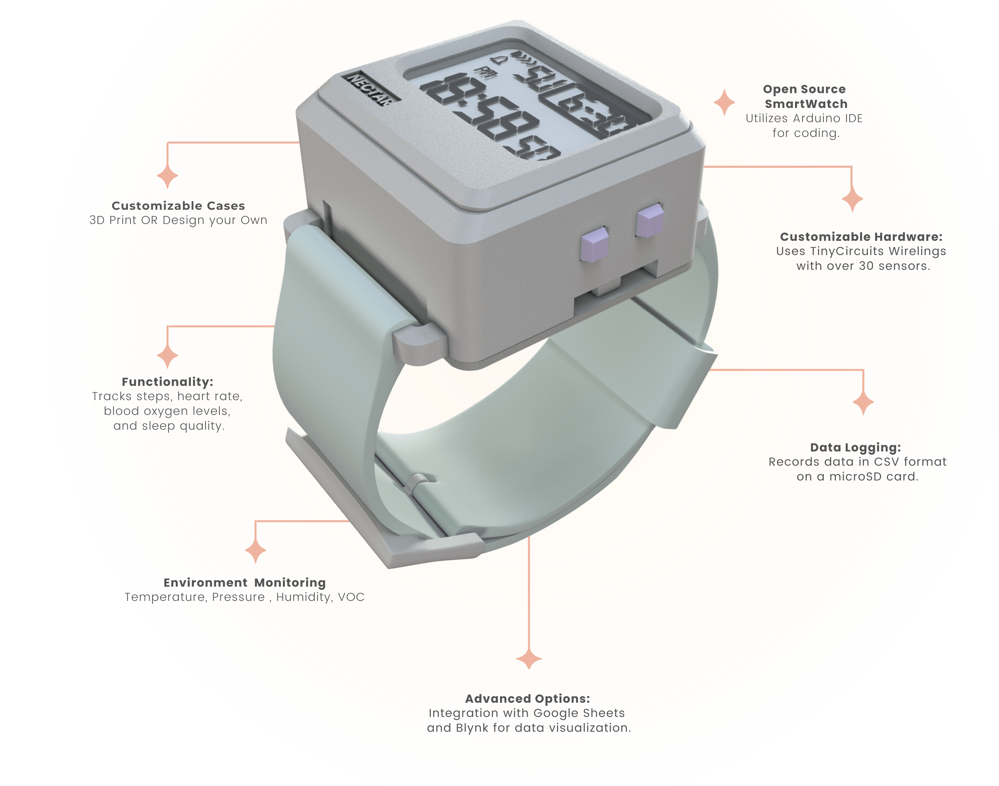

<link href="https://fonts.googleapis.com/css2?family=Nanum+Gothic&display=swap" rel="stylesheet">

# Nectar Core Watch

## Links to used components:
### Basic watch
[Screen Setup Tutorial](https://learn.tinycircuits.com/Processors/TinyScreen%2B_Setup_Tutorial/)
- [TinyScreen+ (Processor, OLED & USB in one)](https://tinycircuits.com/products/tinyscreenplus?omnisendContactID=667715b8e6a47a7272b143f0&utm_campaign=automation%3A+ORDER+CONFIRMATION+%285e7d25c44c7fa442ebf999c8%29&utm_content=5e7d25c44c7fa442ebf999c9&utm_medium=email&utm_source=omnisend)
- [Lithium Ion Polymer Battery - 3.7V 150mAh](https://tinycircuits.com/products/lithium-ion-polymer-battery-3-7v-150mah?_pos=1&_sid=4507ecab2&_ss=r)
- [3D Files for Watchcase](https://drive.google.com/drive/folders/1AFYuaRd69hSPbMeXQXw_nuh95B2V853c?usp=sharing)

### Additional components that can be added for data collection capacity:
[Instructions for building a fitness tracker](https://learn.tinycircuits.com/Wireling-Projects/Custom-Fitness-Tracker-Tutorial/)
- [USB TinyShield](https://tinycircuits.com/products/usb-tinyshield?judgeme_review_source=ZXlKaGJHY2lPaUpJVXpJMU5pSjkuZXlKcWRXUm5aVzFsWDNKbGRtbGxkMTl6YjNWeVkyVWlPaUp0ZFd4MGFTMXlaWFpwWlhjaWZRLnc5dTViUkYzMXI5UWZLNFgwR0paNFQ2MnBFT0xEWXBlV2JXbF9QZVRobjA=&judgeme_token=8a2994ae-bac9-4a56-89d3-afa37f5319a3--em1oq61o&utm_campaign=judgeme-review-request&utm_medium=email&utm_source=judgeme)
- [Bluetooth Low Energy TinyShield (ST)](https://tinycircuits.com/products/bluetooth-low-energy-tinyshield?judgeme_review_source=ZXlKaGJHY2lPaUpJVXpJMU5pSjkuZXlKcWRXUm5aVzFsWDNKbGRtbGxkMTl6YjNWeVkyVWlPaUp0ZFd4MGFTMXlaWFpwWlhjaWZRLnc5dTViUkYzMXI5UWZLNFgwR0paNFQ2MnBFT0xEWXBlV2JXbF9QZVRobjA=&judgeme_token=8a2994ae-bac9-4a56-89d3-afa37f5319a3--4kp1zqp9&utm_campaign=judgeme-review-request&utm_medium=email&utm_source=judgeme)
- [Temperature, Pressure, Humidity, and VOC BME680 Wireling](https://tinycircuits.com/products/temperature-pressure-humidity-and-voc-wireling-bme680?omnisendContactID=667715b8e6a47a7272b143f0&utm_campaign=automation%3A+ORDER+CONFIRMATION+%285e7d25c44c7fa442ebf999c8%29&utm_content=5e7d25c44c7fa442ebf999c9&utm_medium=email&utm_source=omnisend)
- [5-Pin Wireling Cables](https://tinycircuits.com/products/5-pin-extension-cable?omnisendContactID=667715b8e6a47a7272b143f0&utm_campaign=automation%3A+ORDER+CONFIRMATION+%285e7d25c44c7fa442ebf999c8%29&utm_content=5e7d25c44c7fa442ebf999c9&utm_medium=email&utm_source=omnisend)
- [LRA Driver Wireling](https://tinycircuits.com/products/lra-wireling-drv2605?omnisendContactID=667715b8e6a47a7272b143f0&utm_campaign=automation%3A+ORDER+CONFIRMATION+%285e7d25c44c7fa442ebf999c8%29&utm_content=5e7d25c44c7fa442ebf999c9&utm_medium=email&utm_source=omnisend)
- [Pulse Oximeter Sensor Wireling](https://tinycircuits.com/products/pulse-oximetry-sensor-wireling?omnisendContactID=667715b8e6a47a7272b143f0&utm_campaign=automation%3A+ORDER+CONFIRMATION+%285e7d25c44c7fa442ebf999c8%29&utm_content=5e7d25c44c7fa442ebf999c9&utm_medium=email&utm_source=omnisend)
- [Accelerometer Wireling](https://tinycircuits.com/products/accelerometer-wireling-bma250?omnisendContactID=667715b8e6a47a7272b143f0&utm_campaign=automation%3A+ORDER+CONFIRMATION+%285e7d25c44c7fa442ebf999c8%29&utm_content=5e7d25c44c7fa442ebf999c9&utm_medium=email&utm_source=omnisend)
- [WiFi TinyShield (ATWINC1500)](https://tinycircuits.com/products/wifi-tinyshield-atwinc1500?omnisendContactID=667715b8e6a47a7272b143f0&utm_campaign=automation%3A+ORDER+CONFIRMATION+%285e7d25c44c7fa442ebf999c8%29&utm_content=5e7d25c44c7fa442ebf999c9&utm_medium=email&utm_source=omnisend)

## Watch bands
- [Watch bands](https://www.amazon.de/EWENYS-Universal-Silicone-Compatible-Amazfit/dp/B08MVR5KWJ?ref_=ast_sto_dp&th=1&psc=1)